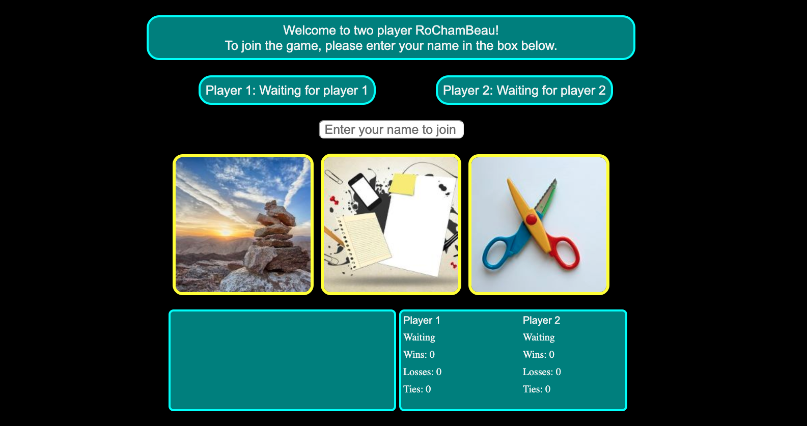

# Classic Multi-Player Rock, Paper, Scissors

Play this classic game of RoChamBo online with a friend!

## Game Play

- Players are asked to enter their name before starting the game
- Game waits for two players
- When both players have joined, either player may click the start button to start the reound
- Rock paper and scissors flash, finally asking the player to shoot
- When both players have selected their choice, the game evaluates the round and saves the results
- Players are invited to play another round
- Leave the game by refreshing or closing the browser window

## Functions and features

- Interactive chat where players can communicate with each other
- Game data persists while both players are in the game
- Game data resets when one or both players leave
- Player can wait for another player if original opponent leaves
- Fully optimized for mobile
- Images courtesy of Pixabay
- Find the game at https://rps-multiplayer-b330a.firebaseapp.com/
- Enjoy!
